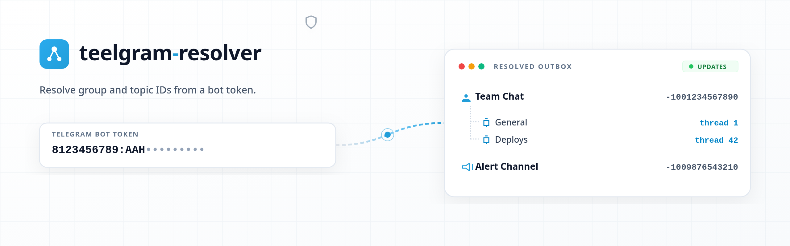

# Telegram Resolver



Paste a Telegram bot token, read its recent update queue, and get the `chat_id` and
`message_thread_id` of every group, supergroup, channel and forum topic the bot has seen — then
fire a test notification at any of them.

Fully static. The token never leaves your browser.

## How it works

1. **`getMe`** confirms the token and reports the bot's identity and capabilities.
2. **`getWebhookInfo`** runs _before_ anything else, because a registered webhook makes the next
   step impossible.
3. **`getUpdates`** reads the pending queue and the app derives the chat/topic tree from it.
4. **`sendMessage`** delivers a test notification to the selected chat, in the selected topic.

Every call goes straight from your browser to `api.telegram.org` as a `GET` request — a CORS
_simple request_, so no preflight is needed and no server sits in the middle.

## What it cannot do

This is the part worth reading. The Bot API offers **no way to list the chats a bot belongs to**,
and **no way to list the topics of a forum**. Everything here is discovered from the update queue,
which means:

- **Only the last 24 hours.** Telegram drops older updates. A group with no recent activity cannot
  appear, and that is not a bug in this app.
- **A webhook blocks everything.** While a webhook is registered, `getUpdates` answers `409
Conflict`. The app detects this up front and tells you which URL is registered — it will **not**
  delete the webhook for you, because that would break whatever depends on it.
- **Privacy mode hides most messages.** With privacy mode on, a bot only receives commands and
  replies addressed to it. The app reads `can_read_all_group_messages` and warns you when this is
  the reason your groups are missing.
- **Topic names are not always available.** A topic's name only travels in service messages
  (`forum_topic_created` / `forum_topic_edited`). Without one, the topic still appears — as
  `Topic #42`, with the correct thread id, which is what you came for.
- **Another poller empties the queue.** If a real bot is polling the same token, it consumes the
  updates before you see them.

This app calls `getUpdates` **without an `offset`** on purpose: passing an offset confirms updates
and permanently removes them from the queue, which would silently steal events from a bot running
in production. It is a read-only observer.

## Your token

- Held in the tab's memory only. Never written to `localStorage`, never logged, never sent to any
  server other than Telegram's. Reload the page and it is gone.
- Validated for shape before it is interpolated into a request URL.
- Chat and topic names come from untrusted users, so every dynamic value is rendered with
  `textContent` — never `innerHTML`.

## Project structure

```text
src/
├── core/telegram/          Pure domain layer — no DOM, no framework
│   ├── client.ts           HTTP calls to the Bot API
│   ├── resolver.ts         Updates → chat and topic tree
│   ├── bot-profile.ts      Bot identity and capabilities
│   ├── errors.ts           Typed errors → actionable messages
│   ├── token.ts            Token shape and masking
│   └── types.ts            Bot API and domain types
├── shared/ui/
│   ├── components/         Static shell + browser controller
│   └── layouts/            Design system
└── pages/index.astro
```

The `core` layer knows nothing about the DOM, so the resolution logic can be exercised on its own.

## Commands

| Command           | Action                             |
| :---------------- | :--------------------------------- |
| `bun install`     | Install dependencies               |
| `bun run dev`     | Dev server at `localhost:4321`     |
| `bun run build`   | Build the static site to `./dist/` |
| `bun run preview` | Preview the production build       |
| `bun run lint`    | oxlint + eslint, with fixes        |
| `bun run format`  | Prettier                           |

Requires Node >= 22.12.

## Stack

[Astro](https://astro.build) (static output, no adapter, no SSR) · [UnoCSS](https://unocss.dev)
with the Wind4 preset · TypeScript · no runtime dependencies.

The output in `dist/` is plain static files and can be served from any CDN.
